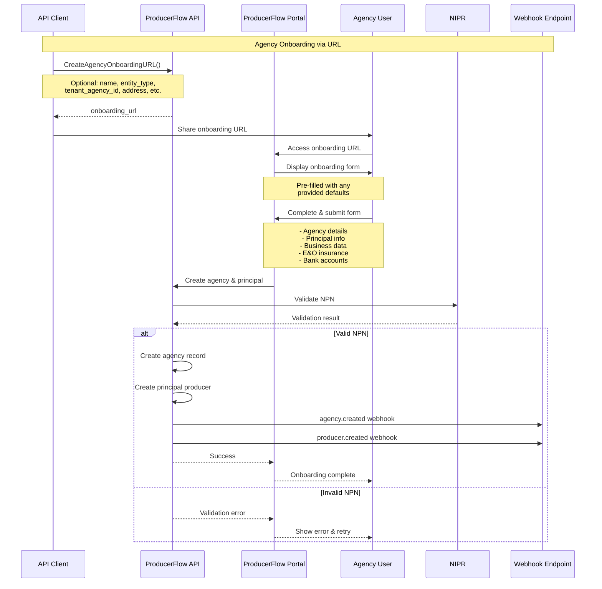
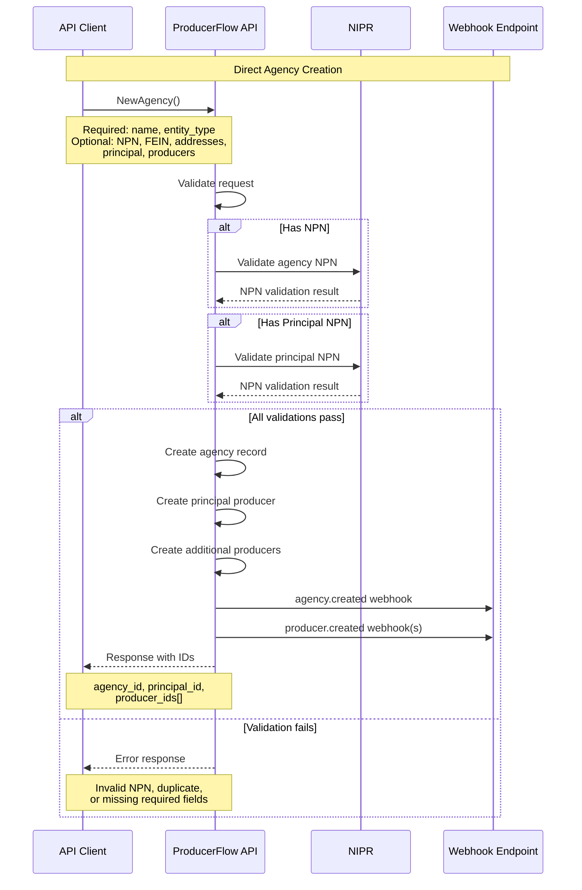
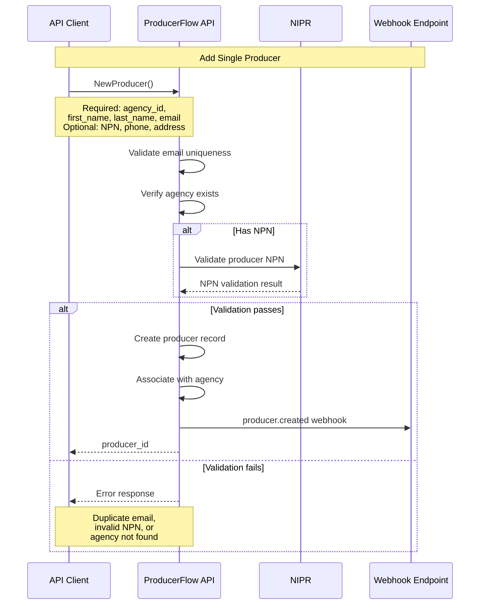
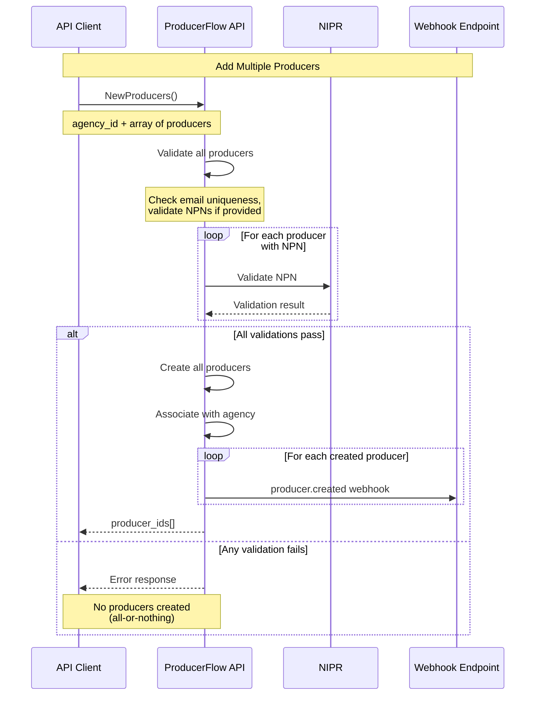
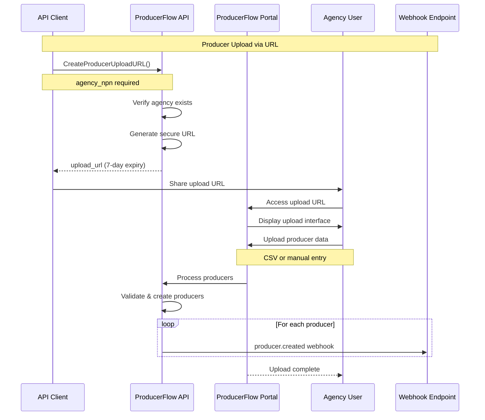
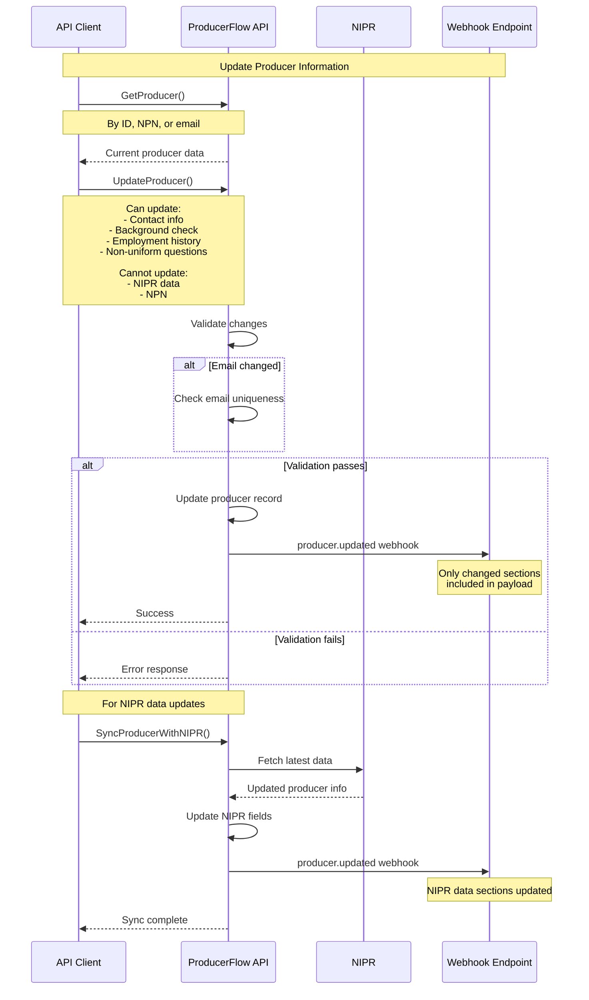
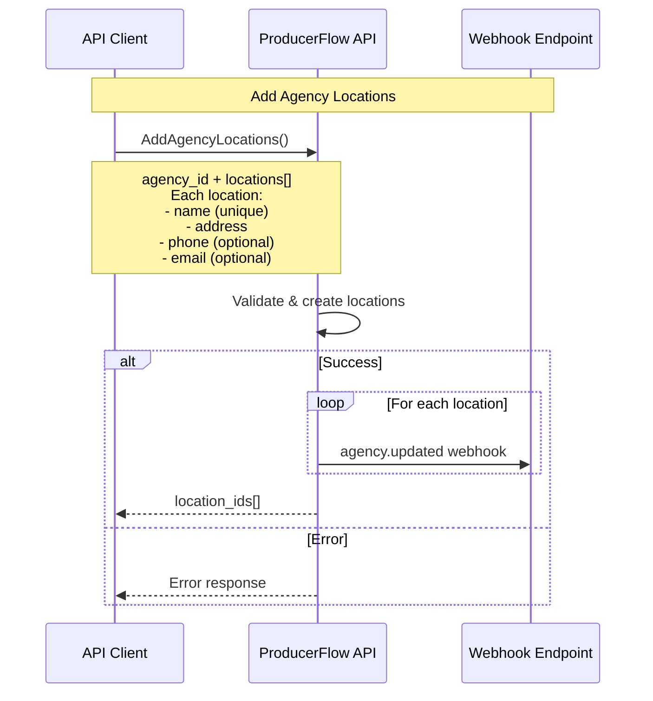
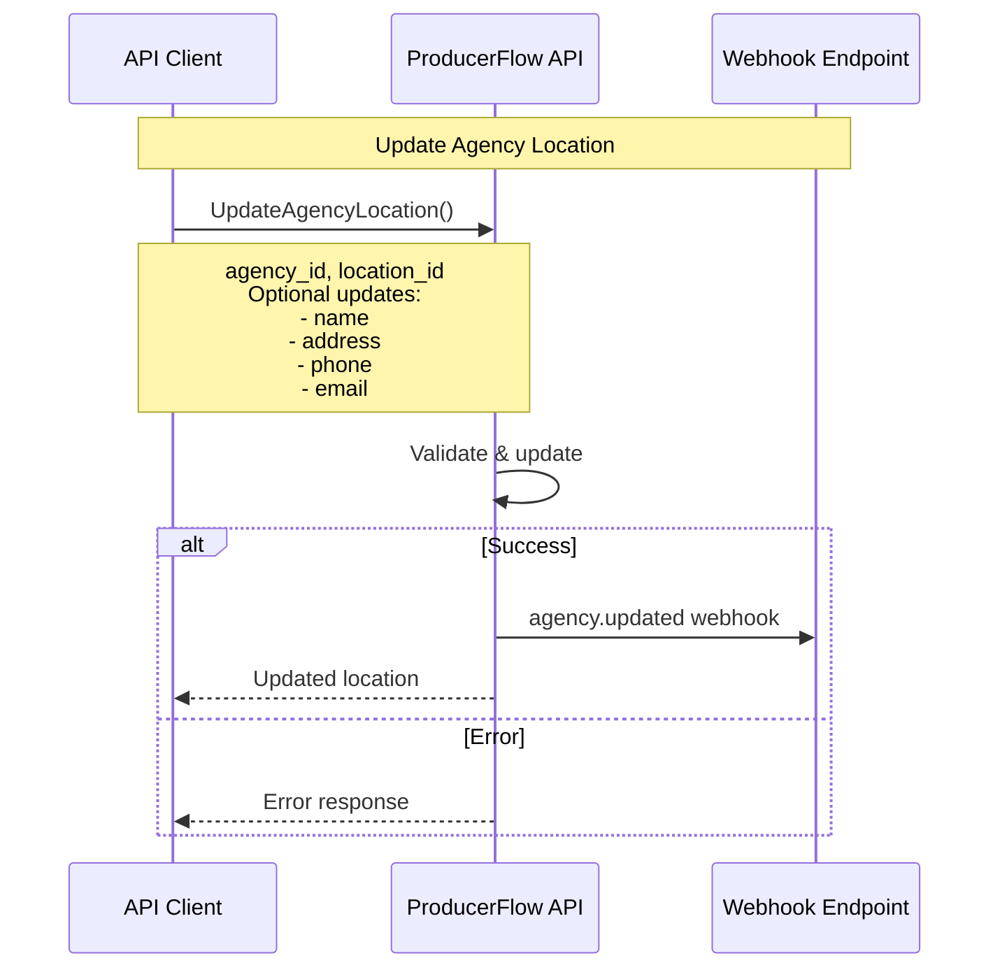
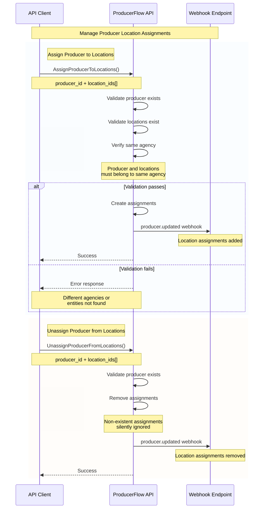
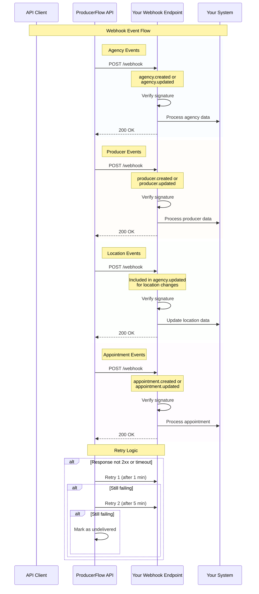

# API Workflows

This document provides visual workflow diagrams for the main operations in the ProducerFlow API, helping developers understand the sequence of API calls and data flow for common integration scenarios.

## Table of Contents

- [API Workflows](#api-workflows)
  - [Table of Contents](#table-of-contents)
  - [1. Agency Creation Workflow](#1-agency-creation-workflow)
    - [Option A: Via Onboarding URL](#option-a-via-onboarding-url)
    - [Option B: Direct API Creation](#option-b-direct-api-creation)
  - [2. Adding Producers to Agency](#2-adding-producers-to-agency)
    - [Single Producer Addition](#single-producer-addition)
    - [Bulk Producer Addition](#bulk-producer-addition)
    - [Producer Upload URL](#producer-upload-url)
  - [3. Editing Producer Information](#3-editing-producer-information)
  - [4. Agency Location Management](#4-agency-location-management)
    - [Creating Agency Locations](#creating-agency-locations)
    - [Updating Agency Locations](#updating-agency-locations)
    - [Assigning Producers to Locations](#assigning-producers-to-locations)
  - [5. Webhook Integration Flow](#5-webhook-integration-flow)

## 1. Agency Creation Workflow

### Option A: Via Onboarding URL

This approach allows agencies to self-onboard through a web portal.

### Option B: Direct API Creation

This approach creates an agency directly through the API.

## 2. Adding Producers to Agency

### Single Producer Addition

### Bulk Producer Addition

### Producer Upload URL

## 3. Editing Producer Information

## 4. Agency Location Management

### Creating Agency Locations

### Updating Agency Locations

### Assigning Producers to Locations

## 5. Webhook Integration Flow

This diagram shows how webhooks are triggered throughout the various workflows.

## Related Documentation

- [Authentication](Authentication.md) - API key setup and usage
- [Webhooks](Webhooks.md) - Detailed webhook integration guide
- [Getting Started with gRPC](Getting-started-with-grpc.md) - gRPC/Connect setup
- [API Reference](API-Reference.md) - Complete API documentation