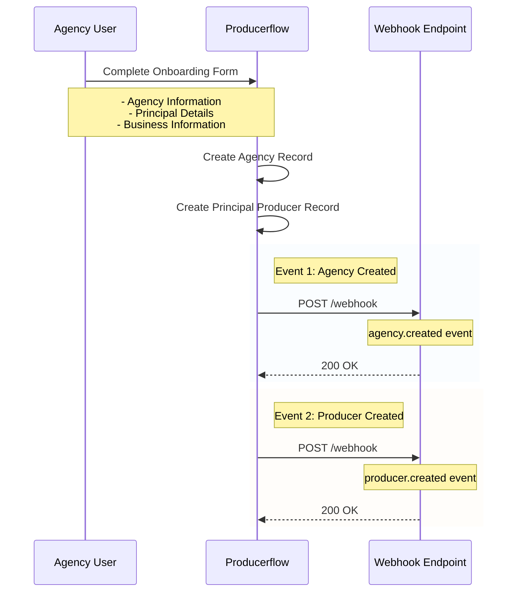
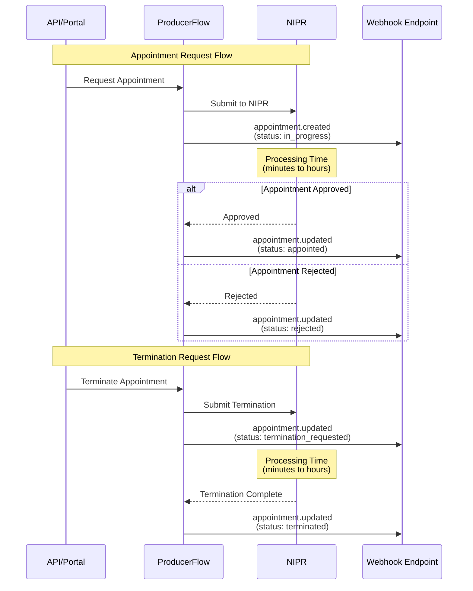

# Webhooks

## Table of Contents

- [Webhooks](#webhooks)
  - [Table of Contents](#table-of-contents)
  - [1. Introduction](#1-introduction)
  - [2. System Overview](#2-system-overview)
    - [Organizations](#organizations)
  - [3. Webhook Integration Overview](#3-webhook-integration-overview)
    - [Key Requirements](#key-requirements)
  - [4. Webhook Configuration](#4-webhook-configuration)
  - [5. Event Mechanics and Types](#5-event-mechanics-and-types)
    - [Creation Events](#creation-events)
    - [Update Events](#update-events)
    - [Resync Events](#resync-events)
  - [6. Agency Onboarding Webhook Flow](#6-agency-onboarding-webhook-flow)
    - [Onboarding Event Sequence](#onboarding-event-sequence)
    - [What Happens During Onboarding](#what-happens-during-onboarding)
    - [Ongoing Events After Agency Creation](#ongoing-events-after-agency-creation)
  - [7. Webhook Payload](#7-webhook-payload)
    - [Common Payload Structure](#common-payload-structure)
    - [Payload Compression](#payload-compression)
    - [Webhook Types and Event Types](#webhook-types-and-event-types)
      - [Agency Webhooks](#agency-webhooks)
      - [Producer Webhooks](#producer-webhooks)
      - [Contact Webhooks](#contact-webhooks)
      - [Appointment Webhooks](#appointment-webhooks)
      - [Organization Webhooks](#organization-webhooks)
    - [Key Elements](#key-elements)
      - [Required Fields](#required-fields)
      - [Identifier Fields](#identifier-fields)
      - [Origin Field Values](#origin-field-values)
    - [Data Sections](#data-sections)
      - [Agency Data Sections](#agency-data-sections)
      - [Producer Data Sections](#producer-data-sections)
      - [Contact Data](#contact-data)
    - [Schema Validation](#schema-validation)
    - [Integration Best Practices](#integration-best-practices)
  - [8. Response and Retries](#8-response-and-retries)
  - [9. Error Handling and Troubleshooting](#9-error-handling-and-troubleshooting)
  - [10. Security Considerations](#10-security-considerations)
  - [11. Signature Verification](#11-signature-verification)
    - [Go example](#go-example)
    - [TypeScript example](#typescript-example)
  - [12. Frequently Asked Questions](#12-frequently-asked-questions)

## 1. Introduction

This document provides detailed instructions for integrating your system to receive changes in Producerflow via webhooks. Webhooks allow your system to receive real-time updates whenever changes occur in our system. This guide will cover how to configure your webhook, the expected data format, and how to handle notifications effectively.

## 2. System Overview

Our system processes various types of data changes, such as producer and agency creation using the API, changes coming from NIPR, or manual updates in the Producerflow portal. By integrating with our Webhook system, you can stay in sync with these updates automatically.

### Organizations

Organizations provide a way to group multiple agencies within ProducerFlow, creating a hierarchical structure for managing related insurance businesses. When agencies are associated with an organization, their producers automatically inherit this organizational relationship, ensuring consistent grouping throughout the system. This organizational information is included in both agency and producer webhook payloads.

## 3. Webhook Integration Overview

A Webhook is an HTTP callback that is triggered when a specified event occurs in our system. You can configure your own Webhook URL, to which our system will send notifications whenever a relevant change happens. These notifications will include a payload containing information about the change.

### Key Requirements

- **Endpoint**: You will provide an HTTPS endpoint for us to call when an event occurs.
- **Timeout**: Webhook calls must be processed within **10 seconds**.
- **Retries**: If a call fails, we make **3 attempts in total** (the initial call plus 2 retries) for most events, and up to 15 attempts for a few event types. See [8. Response and Retries](#8-response-and-retries).

## 4. Webhook Configuration

To configure the webhook:

1. Provide an HTTPS endpoint URL
2. Ensure your endpoint can handle POST requests
3. Implement proper response handling (return 2xx status codes for success)
4. Set up appropriate error handling and logging

## 5. Event Mechanics and Types

### Creation Events

- Creation events for all agencies, producers and contacts will be a unique event of type Created.
- It will contain all information sections documented below per entity if there is data available for them
- For example if no background check was triggered for a producer that section will not be included

### Update Events

- Update events will be sent every time there is a change in field belonging to any of the actions described below per entity
- The update event will only contain the data from the section that has undergone the change (as well as the top level fields that each event contains)
- The event type will be Updated

### Resync Events

- A resync event can be triggered manually from the Producerflow UI for any of the entities
- This will trigger a similar event to the creation one that will contain all information sections documented below per entity if there is data available for them
- The event type is `agency.synced` or `producer.synced`
- A `synced` event means only that the entity's current state was re-sent in full on request. It carries no signal about NIPR. NIPR sync results arrive as `agency.updated` / `producer.updated`, so subscribe to the `updated` events if you want NIPR data

## 6. Agency Onboarding Webhook Flow

When an agency completes the onboarding process in Producerflow, a series of webhook events are automatically triggered to notify integrated systems about the new agency and its principal (primary producer).

### Onboarding Event Sequence



### What Happens During Onboarding

1. **Agency Creation Event (`agency.created`)**: Triggered immediately after the agency record is created

```json
{
  "id": "evt_abc123",
  "event_type": "agency.created",
  "origin": "ProducerFlowPortal",
  "timestamp": "2024-01-15T10:30:00Z",
  "agency_id": "agency_123",
  "external_id": "ext_agency_456",
  "fein": "12-3456789",
  "agency_data": {
    "name": "Smith Insurance Agency",
    "email": "contact@smithagency.com",
    "phone": "555-0100",
    "is_sole_proprietor": false
  },
  "agency_address": [{
    "address_type": "primary",
    "street": "123 Main St",
    "city": "Springfield",
    "state": "IL",
    "zip": "62701"
  }]
}
```

2. **Principal Producer Creation Event (`producer.created`)**: Triggered after the principal record is created

```json
{
  "id": "evt_def456",
  "event_type": "producer.created",
  "origin": "ProducerFlowPortal",
  "timestamp": "2024-01-15T10:30:05Z",
  "producer_id": "producer_456",
  "agency_id": "agency_123",
  "external_agency_id": "ext_agency_456",
  "producer_data": {
    "first_name": "John",
    "last_name": "Smith",
    "email": "john.smith@smithagency.com",
    "phone": "555-0101",
    "street": "123 Main St",
    "city": "Springfield",
    "state": "IL",
    "zip": "62701",
    "is_sole_proprietor": false
  }
}
```

### Ongoing Events After Agency Creation

Once an agency is created, every subsequent change will trigger corresponding webhook events:

- **Producer Events**: Any new producer added to the agency triggers a `producer.created` event, and updates trigger `producer.updated` events
- **Contact Events**: Each contact creation triggers `contact.created`, updates trigger `contact.updated`, and deletions trigger `contact.deleted`
- **Appointment Events**: When appointments are created or updated for producers in the agency, `appointment.created` and `appointment.updated` events are triggered. For NIPR appointments, status changes flow through multiple states, each triggering an `appointment.updated` event:



- **Agency Updates**: Any changes to the agency itself trigger `agency.updated` events

This ensures your system stays synchronized with all changes related to the agency throughout its lifecycle.

## 7. Webhook Payload

### Common Payload Structure

All webhook payloads share a common base structure with the following fields:

```json
{
  "id": "chg_123456789",                    // Unique identifier for this change event
  "event_type": "agency.updated",           // Specific event type (e.g., "agency.updated", "producer.created")
  "origin": "ProducerFlowAPI",              // Source: "ProducerFlowAPI", "ProducerFlowPortal"
  "timestamp": "2024-03-20T15:30:45Z",      // ISO 8601 datetime when change occurred
  // ... entity-specific data follows
}
```

### Payload Compression

Compressed delivery is configured per tenant. When it is enabled for your tenant:

- The request body is gzip-compressed and the request carries `Content-Encoding: gzip`.
- **The signature covers the bytes as sent, so it is computed over the compressed body.** Verify the signature against the raw body exactly as you received it, and inflate afterwards. Middleware that transparently decompresses the body before your handler runs will break verification unless you capture the raw bytes first.
- Once inflated, the JSON is byte-identical to what an uncompressed delivery would have carried.

The rule is the same either way: hash the body you received.

### Webhook Types and Event Types

#### Agency Webhooks

**Event Types:**

- `agency.created` - New agency record created (the agency finished onboarding)
- `agency.updated` - Existing agency record modified, or a NIPR sync completed
- `agency.deleted` - Agency record removed
- `agency.synced` - The agency's full record was re-sent on request (see [Resync Events](#resync-events))

**Schema Reference**: [agency_schema.json](https://github.com/producerflow/producerflowapi/blob/main/webhooks/schema/agency_schema.json)  
**Example Payload**: [agency_example.json](https://github.com/producerflow/producerflowapi/blob/main/webhooks/examples/agency_example.json)

#### Producer Webhooks

**Event Types:**

- `producer.created` - New producer record created (the producer finished onboarding)
- `producer.updated` - Existing producer record modified, or a NIPR sync completed
- `producer.deleted` - Producer record removed
- `producer.synced` - The producer's full record was re-sent on request (see [Resync Events](#resync-events))
- `producer.transferred` - Producer moved from one agency to another within the same tenant. `agency_id` is the target agency; `source_agency_id` is the previous one

**Schema Reference**: [producer_schema.json](https://github.com/producerflow/producerflowapi/blob/main/webhooks/schema/producer_schema.json)  
**Example Payloads**:

- [producer_example.json](https://github.com/producerflow/producerflowapi/blob/main/webhooks/examples/producer_example.json) - Basic producer event
- [producer_transferred_example.json](https://github.com/producerflow/producerflowapi/blob/main/webhooks/examples/producer_transferred_example.json) - Producer transferred between agencies

#### Contact Webhooks

**Event Types:**

- `contact.created` - New contact record created
- `contact.updated` - Existing contact record modified
- `contact.deleted` - Contact record removed

**Schema Reference**: [contact_schema.json](https://github.com/producerflow/producerflowapi/blob/main/webhooks/schema/contact_schema.json)  
**Example Payload**: [contact_example.json](https://github.com/producerflow/producerflowapi/blob/main/webhooks/examples/contact_example.json)

#### Appointment Webhooks

Appointment webhooks deliver real-time notifications when producer-carrier appointment relationships are created, updated, or when their operational status changes. ProducerFlow supports two types of carrier integrations:

1. **NIPR Integration (Asynchronous)**: Appointments go through NIPR processing with statuses like `in_progress`, `appointed`, `termination_requested`, `terminated`, and `rejected`
2. **ProducerFlow Direct Integration (Synchronous)**: Tenant admins create/terminate appointments directly with immediate `appointed` or `terminated` status

**Event Types:**

- `appointment.created` - New appointment record created (NIPR accepted request or direct creation)
- `appointment.updated` - Appointment status changed (NIPR processing results or admin updates)
- `appointment.deleted` - Appointment record removed

**Schema Reference**: [appointment_schema.json](https://github.com/producerflow/producerflowapi/blob/main/webhooks/schema/appointment_schema.json)  
**Example Payloads**:

- [appointment_example.json](https://github.com/producerflow/producerflowapi/blob/main/webhooks/examples/appointment_example.json) - Basic appointment event
- [appointment_operational_status_example.json](https://github.com/producerflow/producerflowapi/blob/main/webhooks/examples/appointment_operational_status_example.json) - Operational status change

**Key Data Included:**

- Appointment details (carrier, state, status, license number)
- Effective and termination dates
- Associated producer and agency information
- National Producer Numbers (NPN) for both agency and producer
- Operational status tracking (`active`, `at_risk`)
- Risk assessment reasons (license expiration, E&O insurance status)
- Appointment termination reasons when applicable

**📋 For comprehensive appointment webhook documentation, including detailed examples, integration patterns, and handling of both NIPR and direct integrations, see: [Appointment Webhook Events](Appointment-events.md)**

**⚕️ For appointment health and compliance monitoring, including operational status tracking and risk management, see: [Appointment Operational Status](Appointment-Operational-Status.md)**

#### Organization Webhooks

Organization events are emitted by the organization create and update handlers (portal, public API, and CSV import) rather than by the change stream.

Changes to the agencies linked to an organization do not produce `organization.*` events; they produce `agency.updated` events for each linked agency.

**Event Types:**

- `organization.created` - New organization created
- `organization.updated` - Existing organization modified

**Schema Reference**: [organization_schema.json](https://github.com/producerflow/producerflowapi/blob/main/webhooks/schema/organization_schema.json)  
**Example Payload**: [organization_example.json](https://github.com/producerflow/producerflowapi/blob/main/webhooks/examples/organization_example.json)

### Key Elements

#### Required Fields

Each webhook type has specific required fields:

- **Agency**: `id`, `timestamp`, `agency_id`
- **Producer**: `id`, `timestamp`, `producer_id`  
- **Contact**: `id`, `timestamp`, `contact_id`
- **Appointment**: `id`, `timestamp`, `appointment_id`

#### Identifier Fields

- **Agency Identifier**: All webhook types include `agency_id`. For agency webhooks, this identifies the agency itself. For producer and contact webhooks, this identifies the associated agency.
- **External Identifiers**: When available, webhooks include `external_id` fields representing identifiers from your system that you've provided to ProducerFlow.
- **National Producer Numbers (NPN)**: Included when available for agencies and producers.

#### Origin Field Values

- **ProducerFlowAPI**: Changes made using the public API, typically by your systems or scripts
- **ProducerFlowPortal**: Changes made through the ProducerFlow web portal by administrators or agency users  
- **NIPR**: Changes originating from the National Insurance Producer Registry

### Data Sections

#### Agency Data Sections

For update events, only the changed section(s) will be included:

- **`agency_data`**: General agency attributes (name, contact info, website, status)
- **`agency_address`**: Physical addresses collected in the Portal
- **`agency_bank_account`**: Bank account information for the agency
- **`agency_eo`**: Errors & Omissions insurance details
- **`agency_ivans_account`**: IVANS account configuration (AMS software, version, etc.)
- **`agency_nipr_data`**: Agency attributes from NIPR
- **`agency_nipr_appointments`**: Carrier appointments from NIPR
- **`agency_nipr_licenses`**: License information from NIPR
- **`agency_nipr_addresses`**: Address information from NIPR
- **`organization`**: Organization information (organization ID, name, and external ID for grouping agencies)

#### Producer Data Sections  

For update events, only the changed section(s) will be included:

- **`producer_data`**: Personal information and contact details
- **`accurate_background_check`**: Background check results from Accurate Background (when available)
- **`producer_nipr_data`**: Producer attributes from NIPR
- **`producer_nipr_appointments`**: Carrier appointments from NIPR
- **`producer_nipr_licenses`**: License information and Lines of Authority from NIPR
- **`producer_nipr_addresses`**: Address information from NIPR
- **`organization`**: Organization information (inherited from associated agency)

#### Contact Data

Contact webhooks contain flattened data including personal information, role, and address details.

### Schema Validation

All webhook payloads conform to JSON Schema Draft 2020-12 specifications. Use the provided schema files in the `webhooks/schema/` directory to:

- Validate incoming webhook payloads
- Generate types/models for your programming language
- Understand complete data structures and field requirements
- Implement proper data validation in your webhook handlers

### Integration Best Practices

1. **Idempotency**: Use the `id` field to handle duplicate webhook deliveries gracefully
2. **Event Filtering**: Check the `event_type` field to process only relevant events for your use case
3. **Schema Validation**: Validate all incoming payloads against the provided JSON schemas
4. **Partial Updates**: For update events, only process the data sections that are present in the payload

## 8. Response and Retries

Your system must respond to our Webhook call with an HTTP status code within **10 seconds**.  

Expected Response:

- **Success (200 OK)**: The request was processed successfully.
- **Failure**: If the request cannot be processed, a status code in the 4xx or 5xx range should be returned.

If the response is a failure or if the 10-second deadline is exceeded, our system will retry the Webhook call up to **two more times**, for **3 attempts in total**.

If all retries fail, the event will be marked as **undelivered**. Undelivered events will not be retried again, and they will be discarded. In the future we will add a way to check for undelivered events in the API.

**Event Redelivery Semantics**:

- Once an event is successfully acknowledged (200 OK), **no further redelivery will occur**.
- While an event is outstanding (not yet acknowledged or deadline expired), **no additional redeliveries** will be initiated.

**Retry Schedule**:

The delay between attempts grows, but it is measured in seconds rather than minutes. A failed attempt is retried after **30 seconds**, and if that also fails, after a further **60 seconds**. With the 10-second response deadline applying to each of the three attempts, that sequence spans roughly **90 to 120 seconds** from the first attempt to the last, and it is abandoned after **3 minutes** in any case.

A few event types are not delivered from the change feed but by internal workflows, and those retry the whole sequence above up to **5 times**, waiting 10, 20, 40 and 80 seconds between sequences. This applies to NIPR sync results, agency principal and NPN changes, `producer.transferred`, `appointment.deleted`, and all `organization.*` events. For those types a persistently failing endpoint can see up to **15 attempts spread over roughly 12 minutes**, against 3 attempts in about 2 minutes for everything else.

If your endpoint answers `429 Too Many Requests` or `503 Service Unavailable` with a `Retry-After` header, we honour that header in place of the delay above.

Size any deduplication or reconciliation window against the longer of these two figures: a redelivery of an event you have already processed can arrive up to about 12 minutes after the original.

**What Triggers a Retry**:

- **Retried**: `5xx` responses, `429 Too Many Requests`, and connection failures (DNS, TCP, TLS, or the 10-second deadline being exceeded).
- **Not retried**: any other `4xx`. A `400` or `404` marks the event undelivered on the first attempt, with no further redelivery. Return a `5xx` if you want us to try again.

**Flow Control**:

For events delivered from the change feed we cap how many deliveries are in flight for your tenant: at most **10 requests** are outstanding (sent but not yet answered) at any one moment. A queued event is only dispatched once one of those slots frees up. For tenants where we additionally enable pacing, deliveries are also rate limited to **5 requests per second** with a burst of 10.

Events delivered by the internal workflows described above do not pass through that queue and are not subject to either limit.

**Event Ordering**:

**No ordering guarantee is offered.** Deliveries run concurrently, each attempt sequence retries on its own schedule, and the two delivery routes above are independent of one another, so events can reach you in a different order from the one in which the underlying changes happened. Use the `timestamp` field and your own record of entity state to resolve ordering rather than relying on arrival order.

## 9. Error Handling and Troubleshooting

To ensure smooth operation:

- Log all incoming Webhook requests and responses.
- Handle errors gracefully in your system by using appropriate status codes.
- Check your server's capacity to process the payload within the given 10-second window.

Common issues include:

- **Timeouts**: Ensure your system can handle large payloads or complex processing efficiently.
- **Incorrect Responses**: Returning status codes other than 200 OK may trigger retries.

## 10. Security Considerations

To ensure secure communication and data protection, we expect the following measures:

1. **HTTPS Only**: Use SSL/TLS-encrypted endpoints to secure data transmission and prevent eavesdropping.
2. **Signature Verification**: Implement HMAC-based signature verification using the shared secret that you can find in the Producerflow portal to authenticate the integrity of incoming requests.
3. **IP Whitelisting** (optional): Restrict incoming requests to trusted IP addresses from our infrastructure to further enhance security.

## 11. Signature Verification

To ensure the integrity and authenticity of the events sent to your webhook endpoint, we use HMAC-based signatures. Each request from our service includes a signature header that allows you to verify that the request originated from us and has not been tampered with.

How It Works:

1. **Shared secret**: ProducerFlow generates a unique shared secret that could be retrieved using the admin portal. This secret is going to be used to sign request payload. Clients must use this secret to verify the integrity of the incoming request. Secret can be retrieved from the Admin portal in the settings page.
2. **Signature header**: ProducerFlow provides a request header ["Producerflow-Signature"] for each request.The hash is generated using HMAC-SHA256 with the shared secret and the request body. Clients must verify signatures using the shared secret.
3. **Verification Process**:
    - Step 1: Extract Producerflow-Signature from the incoming request
    - Step 2: Generate a hash using the HMAC-SHA256 algorithm with the shared secret and the raw request body.
    - Step 3: Compare the generated hash with the value in the Producerflow-Signature header.
    - Step 4: If the hashes match, the request is verified. If they do not match, reject the request as it may have been tampered with.

### Go example

```go
package main

import (
    "crypto/hmac"
    "crypto/sha256"
    "encoding/base64"
)

// Sign generates a HMAC SHA256 hash using the provided payload and secret.
func Sign(payload []byte, secret string) string {
    if secret == "" {
      return ""
    }
    if len(payload) == 0 {
      return ""
    }

    sign := hmac.New(sha256.New, []byte(secret))
    sign.Write(payload)
    return base64.StdEncoding.EncodeToString(sign.Sum(nil))
}

// VerifySignature compares the generated signature with the received signature.
func VerifySignature(payload []byte, receivedSignature, secret string) bool {
    computedSignature := Sign(payload, secret)
    return hmac.Equal([]byte(computedSignature), []byte(receivedSignature))
}
```

### TypeScript example

```typescript
import { createHmac, timingSafeEqual } from 'crypto';

/**
 * Generates a HMAC signature for the given payload using the provided secret.
 * The payload is hashed using SHA-256, and the resulting HMAC is encoded in base64.
 *
 * @param payload - The data to sign
 * @param secret - The secret key for HMAC generation
 * @returns Base64-encoded HMAC signature, or empty string if inputs are invalid
 */
export function signPayload(payload: Buffer | string, secret: string): string {
    if (!secret) {
      return '';
    }

    if (
      !payload ||
      (Buffer.isBuffer(payload) && payload.length === 0) ||
      (typeof payload === 'string' && payload.length === 0)
    ) {
      return '';
    }

    const hmac = createHmac('sha256', secret);
    hmac.update(payload);
    return hmac.digest('base64');
}

/**
 * Verifies the incoming request's signature.
 * @param payload - The raw body of the request (as a Buffer).
 * @param receivedSignature - The signature received from the request's `Producerflow-Signature` header.
 * @param secret - The shared secret used to verify the signature.
 * @returns Boolean indicating if the signatures match.
 */
function verifySignature(payload: Buffer, receivedSignature: string, secret: string): boolean {
  const computed = Buffer.from(signPayload(payload, secret));
  const received = Buffer.from(receivedSignature);

  // timingSafeEqual throws when the buffers differ in length, so reject a
  // malformed signature before comparing rather than letting it raise.
  if (computed.length !== received.length) {
    return false;
  }

  // Use time-safe comparison to avoid timing attacks
  return timingSafeEqual(computed, received);
}

```

## 12. Frequently Asked Questions

- **Q1**: What happens if my Webhook is down during an event?
  - **A1**: We make 3 attempts in total (the initial call plus 2 retries, 30 and 60 seconds apart) before marking the event as undelivered. A few event types retry that sequence up to 5 times; see [8. Response and Retries](#8-response-and-retries).
- **Q2**: Can I send a delayed response?
  - **A2**: Responses must be returned within 10 seconds; otherwise, the request will be considered failed.
